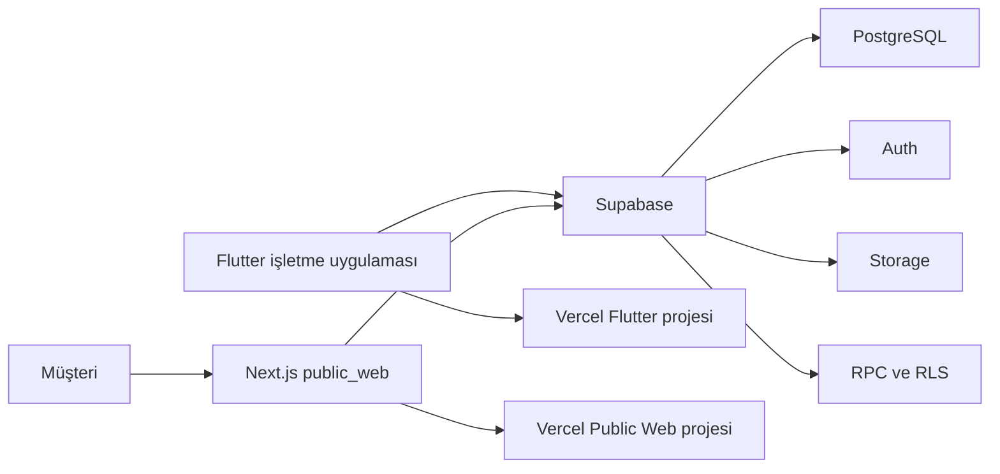
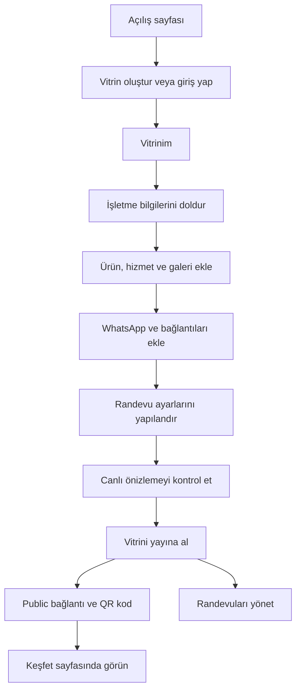
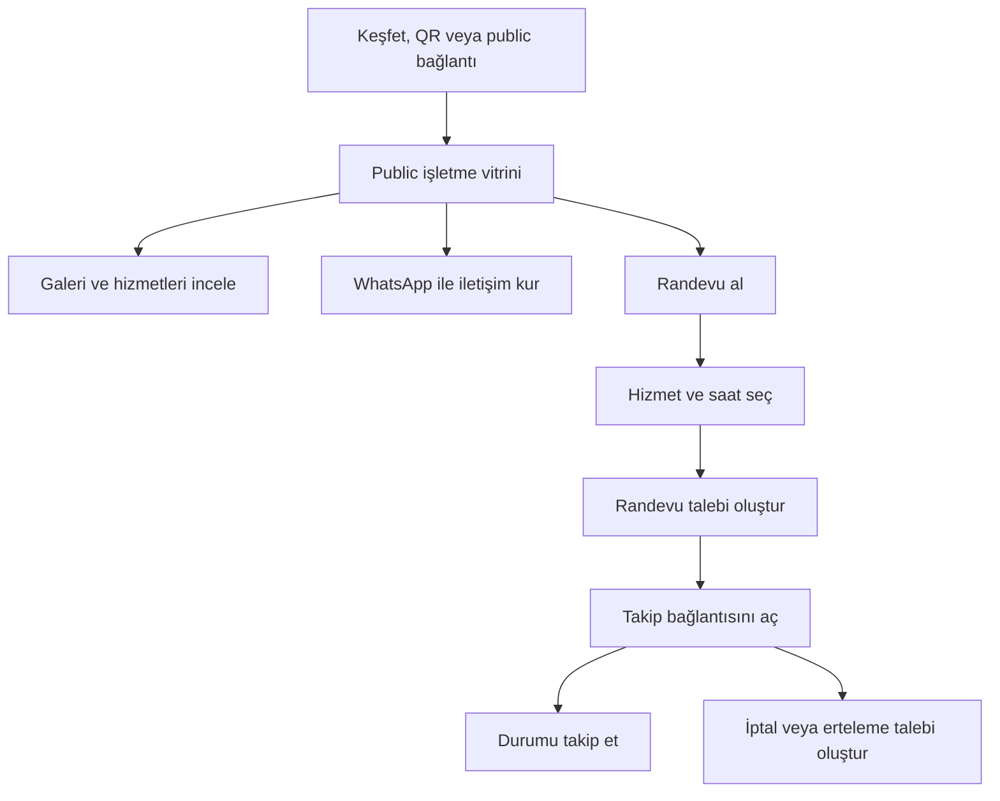

# VixRex

Küçük işletmeler ve esnaf için paylaşılabilir dijital vitrin platformu.

VixRex; işletme bilgilerini, ürünleri, hizmetleri, galeriyi, iletişim
kanallarını ve randevu seçeneklerini tek bir public bağlantıda toplar.
İşletmeler vitrinlerini Flutter uygulamasından yönetir, müşteriler ise
Keşfet ekranı, QR kod veya doğrudan bağlantı üzerinden görüntüler.

> Bu doküman mevcut repo yapısını açıklar. Proje kök dizininde bulunan
> [supabase_schema.sql](file:///c:/Projects/vixrex/supabase_schema.sql) dosyası tüm veritabanı tablolarını,
> RLS politikalarını, trigger'ları ve RPC fonksiyonlarını tek seferde sıfırdan kurmanızı sağlar.

## İçindekiler

- [VixRex nedir?](#vixrex-nedir)
- [Hedef kullanıcılar](#hedef-kullanıcılar)
- [Ana özellikler](#ana-özellikler)
- [Teknik yapı](#teknik-yapı)
- [Gereksinimler](#gereksinimler)
- [Flutter kurulumu](#flutter-kurulumu)
- [Public web kurulumu](#public-web-kurulumu)
- [Ortam değişkenleri](#ortam-değişkenleri)
- [Supabase kurulumu](#supabase-kurulumu)
- [Supabase tabloları](#supabase-tabloları)
- [RPC fonksiyonları](#rpc-fonksiyonları)
- [Demo ekran akışı](#demo-ekran-akışı)
- [Vercel ile yayınlama](#vercel-ile-yayınlama)
- [Kontrol listesi](#kontrol-listesi)
- [Bilinen sınırlamalar](#bilinen-sınırlamalar)

## VixRex nedir?

VixRex; küçük işletmelerin ürünlerini, hizmetlerini, çalışma bilgilerini,
galerisini, iletişim kanallarını ve randevu seçeneklerini tek bir
paylaşılabilir dijital vitrinde yayınlamasını sağlayan Flutter ve web tabanlı
bir platformdur.

| Yüzey | Amaç |
|---|---|
| İşletme uygulaması | Vitrin oluşturma, düzenleme, canlı önizleme, yayınlama ve randevu yönetimi |
| Herkese açık web vitrini | Müşterilerin işletmeyi, galeriyi, hizmetleri ve randevu ekranını görüntülemesi |

VixRex tam kapsamlı bir e-ticaret veya ödeme altyapısı değildir. Temel amacı,
yerel işletmelerin dijital görünürlüğünü ve müşterileriyle iletişimini
kolaylaştırmaktır.

## Hedef kullanıcılar

Birincil hedef kullanıcılar küçük işletmeler, esnaf ve yerel hizmet
sağlayıcılardır.

Örnek kullanım alanları:

- Butik ve mağazalar
- Kuaför ve güzellik salonları
- Kafe ve restoranlar
- Teknik servisler
- Atölyeler
- Danışmanlar
- Randevu veya WhatsApp üzerinden müşteri kabul eden yerel işletmeler

## Ana özellikler

| Özellik | Açıklama |
|---|---|
| Dijital vitrin | İşletme adı, açıklama, durum, iletişim, konum, ürün ve hizmetleri yayınlama |
| Canlı önizleme | Değişiklikleri yayınlamadan önce vitrin görünümünde kontrol etme |
| QR kod | Public vitrin bağlantısını QR kod ile paylaşma |
| WhatsApp | Ürün, hizmet, sipariş veya genel iletişim mesajı başlatma |
| Keşfet | Yayındaki işletmeleri arama, kategoriye göre filtreleme ve görüntüleme |
| Randevu | Uygun saat seçme, talep oluşturma, takip etme, iptal veya erteleme isteme |
| Randevu yönetimi | Talepleri onaylama, reddetme ve müşteriyi WhatsApp ile bilgilendirme |
| Galeri | En fazla 12 işletme, ürün veya mekan görseli yayınlama |
| Ürün ve hizmetler | İşletmeye özel ürün, hizmet, fiyat ve süre bilgileri |
| Public bağlantı | Her işletme için `/v/:slug` biçiminde paylaşılabilir vitrin |
| Konum ve dış bağlantılar | Adres, sosyal medya, web sitesi ve pazar yeri bağlantıları |
| OCR ile ürün çıkarma | Fotoğraf veya faturadan otomatik ürün kataloğu oluşturma (Premium) |

Blog, içerik moderasyonu ve Google görünürlüğü ile ilgili özellikler
`public_web` katmanında ayrı bir web kapsamı olarak bulunur.

## Teknik yapı



| Katman | Teknoloji |
|---|---|
| İşletme uygulaması | Flutter / Dart |
| Public vitrin | Next.js / React |
| Veritabanı | Supabase PostgreSQL |
| Kullanıcı hesabı | Supabase Auth |
| Görsel depolama | Supabase Storage |
| Güvenli işlemler | PostgreSQL RPC ve Row Level Security |
| Yayınlama | Vercel |

Repo içindeki iki web yüzeyi ayrı amaçlara sahiptir:

- Repo kökü: Flutter işletme uygulaması
- `public_web/`: SSR, metadata, sitemap ve robots altyapısı içeren public
  vitrin ve içerik sayfaları

## Gereksinimler

- Flutter stable
- Dart SDK `>=3.7.2 <4.0.0`
- Chrome
- Git
- Node.js `>=20.9.0`
- npm
- Supabase projesi
- Vercel hesabı

```powershell
flutter --version
```

Kurulu Flutter ve Dart sürümünü gösterir.

```powershell
flutter doctor
```

Flutter geliştirme ortamındaki eksikleri kontrol eder.

```powershell
node --version
```

Kurulu Node.js sürümünü gösterir.

```powershell
npm.cmd --version
```

Windows üzerinde kurulu npm sürümünü gösterir.

## Flutter kurulumu

### 1. Projeyi indir

```powershell
git clone <REPO_ADRESI>
cd vixrex
```

`<REPO_ADRESI>` yerine gerçek Git repository adresini yazın.

### 2. Flutter paketlerini indir

```powershell
flutter pub get
```

Bu komut `pubspec.yaml` içindeki Flutter paketlerini indirir.

### 3. Uygulamayı Chrome'da çalıştır

```powershell
flutter run -d chrome `
  --dart-define=SUPABASE_URL="https://PROJE.supabase.co" `
  --dart-define=SUPABASE_PUBLISHABLE_KEY="PUBLIC_KEY" `
  --dart-define=PUBLIC_SITE_URL="http://localhost:3000"
```

Bu komut Flutter web uygulamasını Supabase bağlantı bilgileriyle çalıştırır.

`SUPABASE_PUBLISHABLE_KEY` alanında Supabase'in istemcide kullanılabilen
publishable/anon anahtarı kullanılmalıdır. Service role anahtarı istemciye
verilmemelidir.

## Public web kurulumu

`public_web`, müşterilerin gördüğü Next.js public vitrin uygulamasıdır.

### 1. Paketleri indir

```powershell
npm.cmd --prefix public_web install
```

Bu komut `public_web` projesinin Node.js paketlerini indirir.

### 2. Ortam dosyasını oluştur

`public_web/.env.local`:

```env
SUPABASE_URL=https://PROJE.supabase.co
SUPABASE_PUBLISHABLE_KEY=PUBLIC_KEY
SUPABASE_SERVICE_ROLE_KEY=SERVER_ONLY_KEY
REVALIDATION_SECRET=GUCLU_RASTGELE_DEGER
TURNSTILE_SECRET_KEY=
NEXT_PUBLIC_SITE_URL=http://localhost:3000
NEXT_PUBLIC_APP_URL=http://localhost:8080
INSTAGRAM_CLIENT_ID=
INSTAGRAM_CLIENT_SECRET=
INSTAGRAM_REDIRECT_URI=http://localhost:3000/api/instagram/callback
INSTAGRAM_SCOPES=instagram_business_basic
INSTAGRAM_STATE_SECRET=
INSTAGRAM_TOKEN_ENCRYPTION_KEY=
INSTAGRAM_ALLOWED_ORIGINS=http://localhost:8080
```

`.env.local` dosyası ve gerçek anahtarlar Git'e eklenmemelidir.

### 3. Geliştirme sunucusunu başlat

```powershell
npm.cmd --prefix public_web run dev
```

Public web uygulaması varsayılan olarak `http://localhost:3000` adresinde
çalışır.

## Ortam değişkenleri

### Flutter uygulaması

| Değişken | Zorunlu | Kullanım |
|---|---:|---|
| `SUPABASE_URL` | Evet | Supabase proje adresi |
| `SUPABASE_PUBLISHABLE_KEY` | Evet | İstemcide kullanılan publishable/anon anahtarı |
| `PUBLIC_SITE_URL` | Üretimde | Public vitrin adresi, örneğin `https://vixrex.app` |
| `INSTAGRAM_SYNC_ENABLED` | Instagram hazır olduğunda | Migration ve public API kurulumu bitince `true` yapılır |
| `LEGAL_PRIVACY_EMAIL` | Hayır | Gizlilik ve veri silme iletişim adresi |

Flutter değişkenleri çalışma veya build sırasında `--dart-define` ile
aktarılır. Yalnızca Vercel ortam değişkeni oluşturmak, değişkenin otomatik
olarak Dart koduna aktarılacağı anlamına gelmez.

### Next.js public web

| Değişken | Zorunlu | Kullanım |
|---|---:|---|
| `SUPABASE_URL` | Evet | Supabase proje adresi |
| `SUPABASE_PUBLISHABLE_KEY` | Evet | Public Supabase anahtarı |
| `SUPABASE_SERVICE_ROLE_KEY` | Instagram bağlantısında | Yalnızca server route'larında kullanılan yönetici anahtarı |
| `REVALIDATION_SECRET` | Önerilir | Server-to-server `/api/revalidate` isteklerini doğrular |
| `TURNSTILE_SECRET_KEY` | Hayır | İçerik bildirimlerinde bot doğrulaması |
| `NEXT_PUBLIC_SITE_URL` | Üretimde | Public Next.js adresi |
| `NEXT_PUBLIC_APP_URL` | Üretimde | Flutter uygulama adresi, örneğin `https://app.vixrex.app` |
| `INSTAGRAM_CLIENT_ID` | Instagram bağlantısında | Meta uygulama kimliği |
| `INSTAGRAM_CLIENT_SECRET` | Instagram bağlantısında | Server-only Meta uygulama anahtarı |
| `INSTAGRAM_REDIRECT_URI` | Instagram bağlantısında | Meta panelindeki OAuth callback adresi |
| `INSTAGRAM_SCOPES` | Instagram bağlantısında | Bu akış için `instagram_business_basic` |
| `INSTAGRAM_STATE_SECRET` | Instagram bağlantısında | OAuth state imzası için server-only anahtar |
| `INSTAGRAM_TOKEN_ENCRYPTION_KEY` | Instagram bağlantısında | Token şifrelemek için 32 baytlık anahtar |
| `INSTAGRAM_ALLOWED_ORIGINS` | Instagram bağlantısında | Flutter web origin listesi; birden fazlaysa virgülle ayrılır |

> Gerçek anahtarları README, kaynak kod, commit veya ekran görüntülerine
> eklemeyin.

Instagram Login kısa ömürlü token'ı callback route'unda server tarafında
60 günlük token'a çevirir. Token, bitimine 7 gün kaldığında ve en az 24 saatlik
olduğunda kullanım sırasında yenilenir. Süresi geçmiş token yenilenemez;
kullanıcının hesabı yeniden bağlaması gerekir.

## Supabase kurulumu

### Önemli ön koşul

Mevcut migration dosyaları, `public.stores` tablosunun ve bazı görüntülenme
altyapılarının daha önce oluşturulduğunu varsayar. Repoda şu bileşenlerin ilk
oluşturma SQL'i bulunmaz:

- `public.stores`
- `public.vitrin_views`
- `record_vitrin_view`
- `get_today_vitrin_view_count`

Bu nedenle yeni ve boş bir Supabase projesine yalnızca mevcut migration
dosyalarını uygulamak yeterli değildir. Önce çekirdek şemanın güvenilir bir
yedekten veya doğrulanmış başlangıç migration'ından sağlanması gerekir.

### Kurulum sırası

1. Supabase projesi oluşturun.
2. Project URL ve publishable/anon key değerlerini alın.
3. Çekirdek `stores` ve `vitrin_views` şemasını doğrulayın.
4. Aşağıdaki migration listesini ve Storage sırası uyarısını izleyin.
5. `shelf-images` Storage bucket ve politikalarını doğrulayın.
6. RLS politikalarını kontrol edin.
7. RPC fonksiyonlarını kontrol edin.
8. Önce test projesinde vitrin yayınlama ve randevu akışını deneyin.

Repoda `supabase/config.toml` bulunmadığı için bu doküman Supabase CLI ile
otomatik migration çalıştırıldığını varsaymaz. Mevcut dosyalar Supabase SQL
Editor üzerinden dikkatli biçimde uygulanabilir.

### Migration sırası

1. `20260528_add_gallery_items.sql`
2. `20260530_update_shelf_images_file_limit.sql`
3. `20260603_add_location_fields_to_stores.sql`
4. `20260604_add_logo_url_to_stores.sql`
5. `20260604_add_products_to_stores.sql`
6. `20260604_add_storage_policies_for_shelf_images.sql`
7. `20260604_add_user_id_and_auth_policies.sql`
8. `20260604_remediate_security_advisor_warnings.sql`
9. `20260604_fix_remaining_security_advisor_warnings.sql`
10. `20260613_add_delete_user_account_function.sql`
11. `20260621_add_offerings_to_stores.sql`
12. `20260622_add_booking_system.sql`
13. `20260622_add_google_visibility_and_blog.sql`
14. `20260622_add_quality_and_spam_controls.sql`
15. `20260622_published_at_and_updated_at.sql`
16. `20260707_add_ocr_premium_tables.sql`

> Bazı migration'lar mevcut tablo, politika ve fonksiyonları değiştirir.
> Dosyaların tekrar çalıştırılmasının her durumda güvenli olduğu
> varsayılmamalıdır. Önce test Supabase projesinde doğrulayın.

### Storage sırası uyarısı

`20260530_update_shelf_images_file_limit.sql`, `shelf-images` limitini 15 MB
yapar. Daha sonraki `20260604_add_storage_policies_for_shelf_images.sql` ise
bucket oluştururken veya güncellerken limiti tekrar 5 MB yapar.

Flutter tarafındaki dosya doğrulayıcı 15 MB kabul ettiği için yeni ortam
kurulumunda:

1. Önce `20260604_add_storage_policies_for_shelf_images.sql` ile bucket ve
   politikaları oluşturun.
2. Ardından `20260530_update_shelf_images_file_limit.sql` dosyasını yeniden
   uygulayarak son limiti 15 MB yapın.
3. Supabase Storage ayarlarında `file_size_limit = 15728640` olduğunu
   doğrulayın.

Bu özel tekrar yalnızca bucket limitini güncelleyen `20260530` dosyası içindir;
diğer migration'ların tekrar çalıştırılabileceği anlamına gelmez.

## Supabase tabloları

Aşağıdaki tablo ve fonksiyon listeleri, bu repodaki migration dosyaları ve
istemci çağrılarından çıkarılmıştır. Bağlı uzak Supabase projesinin eksiksiz
şema envanteri olduğu anlamına gelmez.

### Çekirdek tablolar

| Tablo | Amaç | Repo durumu |
|---|---|---|
| `stores` | İşletme, vitrin, galeri, ürün, hizmet ve yayın bilgileri | Kullanılıyor; ilk oluşturma migration'ı yok |
| `vitrin_views` | Public vitrin görüntülenme kayıtları | Kullanılıyor; ilk oluşturma migration'ı yok |

### Randevu tabloları

| Tablo | Amaç |
|---|---|
| `booking_settings` | Randevu durumu, kapasite, çalışma saatleri ve öğle arası |
| `booking_blocks` | Kapalı veya bloke edilen tarih ve saatler |
| `appointments` | Müşteri randevu talepleri |
| `appointment_reschedule_requests` | Randevu erteleme talepleri |

### İçerik ve moderasyon tabloları

| Tablo | Amaç |
|---|---|
| `store_articles` | İşletmeye ait blog, haber ve kampanya içerikleri |
| `admins` | İçerik moderasyonu yapabilen kullanıcılar |
| `article_reports` | Kullanıcılar tarafından bildirilen içerikler |

### Storage

| Bucket | Amaç |
|---|---|
| `shelf-images` | Kapak, galeri ve vitrin görselleri |

## RPC fonksiyonları

### Vitrin ve hesap

| RPC | Amaç |
|---|---|
| `link_store_to_user` | Anonim oluşturulmuş vitrini giriş yapan kullanıcıya bağlar |
| `update_store_with_token` | Edit token ile vitrini güvenli şekilde günceller |
| `delete_user_account` | Kullanıcının kendi hesabını ve bağlı verilerini siler |

### Görüntülenme

| RPC | Amaç |
|---|---|
| `record_vitrin_view` | Public vitrin görüntülenmesini kaydeder |
| `get_today_vitrin_view_count` | İşletmenin günlük görüntülenme sayısını getirir |

Bu iki görüntülenme RPC'sinin ilk oluşturma SQL'i repoda bulunmaz.

### Randevu

| RPC | Amaç |
|---|---|
| `get_public_booking_slots` | Seçilen gün için uygun randevu saatlerini hesaplar |
| `create_appointment_request` | Yeni randevu talebi oluşturur |
| `get_appointment_by_token` | Takip koduyla randevu bilgisini getirir |
| `cancel_appointment_by_token` | Müşterinin randevusunu iptal eder |
| `request_appointment_reschedule` | Yeni tarih veya saat talebi oluşturur |
| `respond_to_appointment` | İşletmenin talebi onaylamasını veya reddetmesini sağlar |

### Moderasyon

| RPC | Amaç |
|---|---|
| `approve_store_article` | İncelenen içeriği onaylar |
| `reject_store_article` | İncelenen içeriği gerekçeyle reddeder |

### Trigger ve yardımcı fonksiyonlar

Aşağıdaki fonksiyonlar istemcinin normal kullanımda doğrudan çağırdığı RPC
listesinden ayrıdır:

- `mask_appointment_name`
- `set_updated_at`
- `set_published_at`
- `set_published_at_on_insert`
- `on_article_before_save`
- `on_article_approved`
- `on_article_spam_check`
- `on_store_trust_protection`

## OCR (Optik Karakter Tanıma)

VixRex, fotoğraflardan veya faturalardan otomatik ürün çıkarma özelliği sunar.

### Nasıl Çalışır?

```
Fotoğraf/Fatura → OCR ile metin okuma → Ürün eşleştirme → Kullanıcı onayı → Vitrine ekleme
```

### Bileşenler

| Bileşen | Dosya | Amaç |
|---|---|---|
| OCR Servisi | `lib/services/ocr/ocr_service.dart` | Ana koordinatör |
| Metin Ayrıştırıcı | `lib/services/ocr/ocr_text_parser.dart` | ML Kit OCR |
| Fiyat Çıkarıcı | `lib/services/ocr/ocr_price_parser.dart` | Türk formatı fiyat |
| Ürün Eşleştirici | `lib/services/ocr/ocr_product_matcher.dart` | Excel verisi ile eşleştirme |
| Görsel Ön İşleme | `lib/services/ocr/ocr_image_preprocessor.dart` | Gri tonlama, kontrast, keskinlik |
| Controller | `lib/controllers/ocr_controller.dart` | State yönetimi |
| Tarama Ekranı | `lib/screens/ocr_scanner_screen.dart` | Kullanıcı arayüzü |

### Premium Özellikleri

| Özellik | Ücretsiz | Premium |
|---|---|---|
| OCR kullanımı | Günde 3 | Sınırsız |
| Toplu yükleme | Yok | Var |
| Excel içe aktarma | Yok | Var |
| Barkod tarama | Yok | Var |

### Supabase Tabloları

- `ocr_usage` → Günlük OCR kullanımı takibi
- `ocr_history` → OCR geçmişi
- `product_database` → Ürün veritabanı (OCR doğrulama için)

## Demo ekran akışı

Repoda README için hazırlanmış ekran görüntüleri bulunmadığından demo,
doğrulanmamış görseller yerine gerçek ekran davranışlarını gösteren akış
şemalarıyla anlatılır.

### İşletme sahibi akışı



### Müşteri akışı



### Manuel demo senaryosu

1. Flutter uygulamasını Chrome'da açın.
2. Kayıt olun, giriş yapın veya yeni vitrin oluşturma akışını başlatın.
3. `Vitrinim` ekranına geçin.
4. İşletme adı ve geçerli WhatsApp numarası ekleyin.
5. Kapak veya galeri görseli ekleyin.
6. İsteğe bağlı ürün, hizmet ve randevu ayarı ekleyin.
7. Canlı önizlemeyi kontrol edin.
8. Vitrini yayına alın.
9. Oluşan public bağlantıyı veya QR kodu açın.
10. Keşfet, WhatsApp ve randevu akışlarını test edin.

## Vercel ile yayınlama

Repo yapılandırması, Flutter uygulaması ve Next.js public web için iki ayrı
Vercel projesini hedefler. Canlı domain ve DNS durumu bu README incelemesinde
doğrulanmamıştır.

| Vercel projesi | Root Directory | Amaç | Yapılandırmada kullanılan domain |
|---|---|---|---|
| VixRex App | Repo kökü | Flutter işletme uygulaması | `app.vixrex.app` |
| VixRex Public Web | `public_web` | Public vitrin ve SEO sayfaları | `vixrex.app` |

### Flutter Vercel projesi

Vercel ayarları:

- Root Directory: repo kökü
- Framework Preset: Other
- Build Command: `bash vercel-build.sh`
- Output Directory: `build/web`

Ortam değişkenleri:

```text
SUPABASE_URL
SUPABASE_PUBLISHABLE_KEY
PUBLIC_SITE_URL=https://vixrex.app
```

`vercel-build.sh`, gerekli Flutter stable kurulumunu hazırlar ve release web
build üretir.

Kök `vercel.json`, Flutter uygulamasındaki public vitrin, sitemap ve robots
isteklerini `https://vixrex.app` adresine yönlendirir.

### Next.js public web projesi

Vercel ayarları:

- Root Directory: `public_web`
- Framework Preset: Next.js
- Build Command: `npm run build`

Ortam değişkenleri:

```text
SUPABASE_URL
SUPABASE_PUBLISHABLE_KEY
REVALIDATION_SECRET
TURNSTILE_SECRET_KEY
```

`TURNSTILE_SECRET_KEY` yalnızca bot doğrulaması kullanılacaksa gereklidir.

### Domain dağılımı

| Adres | Amaç |
|---|---|
| `app.vixrex.app` | Flutter işletme uygulaması |
| `vixrex.app` | Public Next.js sitesi |
| `vixrex.app/v/:slug` | İşletmenin public vitrini |
| `vixrex.app/sitemap.xml` | Arama motoru sitemap'i |
| `vixrex.app/robots.txt` | Arama motoru tarama kuralları |

### Revalidation notu

`/api/revalidate`, `x-revalidate-secret` başlığını Next.js projesindeki
`REVALIDATION_SECRET` ile karşılaştırır. Server-to-server tetikleyicide kullanılan
değer ile Next.js Vercel ortamındaki değer birebir aynı olmalıdır.

Ortak secret Flutter web bundle'ına gömülmemelidir; `--dart-define` değerleri
istemci JavaScript'i içinde okunabilir. Instagram import route'u revalidation'ı
zaten server tarafında doğrudan tetikler. Diğer güncellemeler için 300 saniyelik
ISR fallback korunur; Flutter'dan anlık tetikleme gerekiyorsa kullanıcı oturumunu
doğrulayan ayrı bir server endpoint'i kullanılmalıdır.

## Kontrol listesi

### Flutter

```powershell
flutter analyze
```

Dart ve Flutter hata/uyarılarını kontrol eder.

```powershell
flutter run -d chrome `
  --dart-define=SUPABASE_URL="https://PROJE.supabase.co" `
  --dart-define=SUPABASE_PUBLISHABLE_KEY="PUBLIC_KEY" `
  --dart-define=PUBLIC_SITE_URL="http://localhost:3000"
```

Flutter web uygulamasının Chrome üzerinde açıldığını doğrular.

### Public web

```powershell
npm.cmd --prefix public_web run lint
```

Next.js ve TypeScript kod kalitesi kontrollerini çalıştırır.

```powershell
npm.cmd --prefix public_web run build
```

Public web projesinin üretim build'ini kontrol eder.

### Manuel fonksiyon kontrolü

- Kullanıcı kaydı ve giriş
- Vitrin oluşturma ve güncelleme
- Galeri yükleme
- Public vitrin bağlantısı
- QR kod
- Keşfet listesi
- WhatsApp yönlendirmesi
- Randevu oluşturma ve takip
- İşletme randevu yönetimi
- Public sitemap ve robots yanıtları

## Bilinen sınırlamalar

- `stores` ve `vitrin_views` için başlangıç migration'ları repoda yoktur.
- Görüntülenme RPC'lerinin ilk oluşturma SQL'leri repoda yoktur.
- `supabase/config.toml` bulunmadığı için Supabase CLI akışı hazır değildir.
- Storage migration dosyaları farklı limitler tanımlar; son bucket limiti
  uygulamanın 15 MB doğrulamasıyla ayrıca eşleştirilmelidir.
- Flutter ve Next.js deployment'ları ayrı Vercel projeleri olarak
  yapılandırılmalıdır.
- `public_web`, ayrı bir Next.js Vercel projesi olarak bağlanmadan API route'ları
  üretimde çalışmaz.
- README kurulumu açıklar; mevcut migration veya build sorunlarını otomatik
  olarak düzeltmez.
- VixRex ödeme veya tam e-ticaret altyapısı sağlamaz.

## Güvenlik

- Service role anahtarını Flutter veya Next.js istemci koduna eklemeyin.
- Gerçek ortam değişkenlerini Git'e göndermeyin.
- Migration'ları doğrudan üretimde çalıştırmadan önce test projesinde deneyin.
- RLS politikalarını devre dışı bırakmayın.
- Kullanıcı yüklemeleri için dosya boyutu ve MIME türü kontrollerini koruyun.
