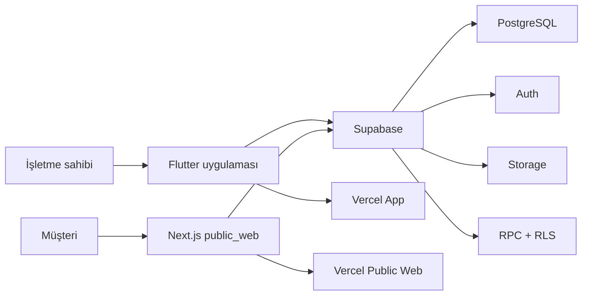

# Vixrex

**Küçük işletmeler, esnaf ve ürün odaklı firmalar için dijital vitrin, katalog, keşif ve müşteri yönlendirme platformu.**

Vixrex; bir işletmenin profilini, ürünlerini, hizmetlerini, galerisini, konumunu, çalışma bilgilerini, randevu seçeneklerini ve iletişim kanallarını tek bir paylaşılabilir bağlantıda toplar.

İşletme sahibi Flutter uygulamasından vitrini oluşturur ve yönetir. Müşteri ise Next.js tabanlı public web üzerinden işletmeyi ve ürünleri görüntüler; QR kod, Keşfet, Google veya doğrudan bağlantı üzerinden vitrini bulur ve WhatsApp ya da işletmenin kendi satış kanalına yönlenir.

> Vixrex şu anda sepet, ödeme, kargo ve iade yöneten tam kapsamlı bir e-ticaret altyapısı değildir. Temel ürün yaklaşımı; işletmeyi ve ürünlerini dijitalde görünür hale getirmek, SEO sayfaları üretmek ve müşteriyi işletmenin kendi iletişim veya sipariş kanalına taşımaktır.

## Ürün durumu

| Durum | Anlamı |
|---|---|
| ✅ Aktif | Kodda bulunan ve mevcut Vixrex akışına bağlı özellik |
| 🧪 Yapılandırma gerekir | Kodda mevcut; harici servis, migration veya ortam değişkeni gerektirir |
| 🛣️ Yol haritası | Henüz üretim özelliği değildir |

## Vixrex ne sağlar?

### İşletme sahibi için

- Asistan eşliğinde hızlı vitrin oluşturma
- Misafir olarak vitrin yayınlama ve sonradan hesaba bağlama
- İşletme adı, açıklama, WhatsApp, adres ve konum yönetimi
- Kapak, logo ve galeri görselleri
- Ürün, hizmet ve kategori yönetimi
- Ürünlere fiyat, açıklama, stok durumu ve çoklu görsel ekleme
- Instagram gönderisinden ürün aktarma
- Fiş veya etiket görselinden OCR ile ürün adayı çıkarma
- Hazır kategori şablonlarıyla başlangıç içeriği oluşturma
- Randevu ayarları ve talep yönetimi
- Canlı önizleme, yayınlama, QR kod ve paylaşım
- VixRex rehberiyle eksik alanları ve sıradaki adımı görme

### Müşteri için

- İşletmeye özel `/v/:slug` public vitrin
- Ürün kataloğu ve ayrı ürün detay sayfaları
- Ürün veya işletme üzerinden WhatsApp iletişimi
- İşletme web sitesi, Instagram ve pazaryeri bağlantıları
- Konum ve harita yönlendirmesi
- Online randevu talebi ve takip bağlantısı
- Keşfet üzerinden işletme arama ve kategori filtreleme
- Google tarafından taranabilen metadata, sitemap ve yapılandırılmış veri

---

# Ana özellikler

## 1. Vixrex Asistan ile vitrin oluşturma ✅

Vixrex’in kurulum asistanı ayrı bir yayın motoru veya ikinci bir editör değildir. Mevcut `StoreEditorController`, konum bileşeni, yasal onay bileşeni ve yayın servisini sohbet biçiminde yöneten hızlı kurulum katmanıdır.

### Kurulum akışı

```text
Landing / Vixrex Oluştur
        ↓
İşletme adı
        ↓
WhatsApp numarası
        ↓
GPS veya il / ilçe / adres
        ↓
Yasal onaylar
        ↓
Vitrini yayınla
        ↓
/v/:slug public bağlantısı
```

Asistanın kullandığı mevcut parçalar:

| İşlem | Kullanılan gerçek Vixrex bileşeni |
|---|---|
| Form ve vitrin verisi | `StoreEditorController` |
| Konum | `FormLocationInfo` ve mevcut konum editörü |
| Yasal onay | `LegalConsentSection` |
| Yayın | `StoreEditorController.publish()` → `StorePublishService` |
| Misafir vitrin oluşturma | `create_store_with_token` Supabase RPC |
| Public bağlantı | `PublicSiteConfig` ve `/v/:slug` |

Kurulum tamamlandığında kullanıcı:

- Public bağlantıyı kopyalayabilir veya açabilir.
- Vitrin editörüne geçebilir.
- Hesap oluşturarak mevcut misafir vitrini hesabına bağlayabilir.
- Kapak, galeri, açıklama, ürün ve randevu adımlarına devam edebilir.

### Asistanın iki çalışma biçimi

1. **Kurulum modu:** `VixRexOnboardingChatScreen`
   - Ad, WhatsApp, konum, yasal onay ve yayın akışını tamamlar.

2. **Rehber modu:** `VixRexScreen` + `VixRexGuidanceService`
   - Mevcut vitrine göre sıradaki adımı önerir.
   - Kapak, açıklama, galeri, ürün, OCR, paylaşım, QR ve randevu alanlarına yönlendirir.
   - Vitrin kalite puanı ve eksik alan kontrolü üretir.

### Yapay zekâ durumu

Kurulum sohbeti aktif olarak kontrollü ve kural tabanlı çalışır; yayın için kullanıcıdan alınan alanları doğrudan mevcut editör akışına aktarır.

Repoda serbest metinden alan önerisi üretmek için `supabase/functions/vixrex-assistant-nlu` fonksiyonu da bulunur. Bu fonksiyon şu anda `assistantEnabled = false` olduğu için üretimde aktif değildir. Aktif edildiğinde bile veritabanına doğrudan yazmaz; yalnız öneri döndürür ve kayıt işlemi kullanıcı onayından sonra mevcut editör üzerinden yapılır.

---

## 2. Dijital vitrin editörü ✅

İşletme sahibi aşağıdaki bilgileri tek editörden yönetebilir:

- İşletme adı ve işletme türü
- Kısa açıklama ve kurumsal biyografi
- WhatsApp, Instagram ve web sitesi
- Adres, il, ilçe, GPS koordinatı ve Google Business bağlantısı
- Çalışma saatleri ve işletme durumu
- Logo, kapak ve galeri
- Ürünler, hizmetler ve kategoriler
- Pazaryeri bağlantıları
- Randevu ayarları
- KVKK, kullanım koşulları ve yayınlama onayları

Değişiklikler yayınlanmadan önce canlı vitrin önizlemesinde kontrol edilebilir.

---

## 3. Ürün katalog sistemi ✅

Mevcut ürün modeli aşağıdaki alanları destekler:

| Alan | Destek |
|---|---|
| Ürün adı | ✅ |
| Açıklama | ✅ |
| Fiyat metni | ✅ |
| Kategori ve kategori kimliği | ✅ |
| Stok durumu | `Mevcut`, `Tükendi`, `Son birkaç adet` |
| Görünür / gizli | ✅ |
| Ürün başına görsel | En fazla 4 URL |
| Kalıcı ürün slug alanı | ✅ |
| Kaynak bilgisi | Manuel, Instagram, OCR veya kategori şablonu gibi kaynakları işaretleyebilir |
| Kaynak medya kimliği ve bağlantısı | ✅ |

### Ürün ekleme kanalları

#### Manuel ürün ekleme ✅

İşletme sahibi ürün adı, fiyat, açıklama, kategori, stok durumu ve görselleri elle yönetebilir.

#### Hazır kategori şablonları ✅

`category_image_templates` ve `apply_category_template` altyapısı, işletme kategorisine göre boş alanlara hazır içerik uygulayabilir:

- Kapak görseli
- Logo yer tutucusu
- Galeri görselleri
- Başlangıç ürün örnekleri

Şablon uygulaması mevcut verileri ezmek yerine yalnız boş alanları dolduracak şekilde tasarlanmıştır ve mağaza sahibi veya geçerli edit token ile yetkilendirilir.

#### Instagram’dan ürün aktarma 🧪

Meta yapılandırması tamamlandığında işletme:

1. Instagram hesabını bağlar.
2. Hesaptaki uygun medya gönderilerini listeler.
3. Bir görsel seçer.
4. Fiyat ve kategori girer.
5. Gönderiyi Vixrex ürününe dönüştürür.

Aktarılan üründe Instagram kaynak kimliği, kaynak bağlantısı ve aktarım zamanı saklanabilir. Instagram OAuth ve import route’larının çalışması için Meta uygulaması, callback adresleri, migration ve server-only ortam değişkenleri gerekir.

#### OCR ile ürün çıkarma 🧪

OCR modülü şu işlemleri koordine eder:

```text
Görsel
  → ML Kit metin tanıma
  → satır ve fiyat ayrıştırma
  → ürün adaylarını eşleştirme
  → kullanıcı onayı / düzenleme
  → editörde ürün oluşturma
```

Desteklenen akışlar:

- Fiş okuma
- Raf veya etiket metni okuma
- Ürün adaylarını tek tek onaylama veya reddetme
- Tümünü onaylama
- Ürün adını ve fiyatını düzenleme
- Onaylanan ürünleri mevcut vitrin editörüne ekleme
- Düzeltmeleri OCR geri bildirim tablosuna kaydetme

**Önemli platform notu:** Gerçek Google ML Kit OCR işlemi mobil/yerel platformlarda çalışır. Flutter web tarafında mevcut kod sentetik test verisi üretir; gerçek web OCR olarak değerlendirilmemelidir.

### Premium durumu

OCR kullanım tabloları ve premium alanları repoda bulunur. Ancak gerçek ödeme sağlayıcısına bağlı, doğrulanmış üretim satın alma akışı tamamlanmış değildir. README bu nedenle OCR’ı çalışan teknik modül, ödeme/premium tarafını ise üretim öncesi yapılandırma olarak değerlendirir.

---

## 4. Public işletme vitrini ✅

Next.js `public_web` katmanı müşteriye sunulan public HTML yüzeyidir.

Temel rota:

```text
/v/:slug
```

Public vitrin şunları gösterebilir:

- İşletme adı, açıklaması ve kategori bilgisi
- Kapak, logo ve galeri
- Ürün ve hizmet listesi
- Kategori koleksiyonları
- WhatsApp iletişim bağlantısı
- Instagram, web sitesi ve pazaryeri bağlantıları
- Adres ve harita yönlendirmesi
- Çalışma saatleri
- Randevu bağlantısı
- Blog, haber veya kampanya içerikleri

Flutter uygulama hostu public vitrin HTML’i üretmez. `/v/*`, ürün sayfaları, sitemap ve robots içerikleri Next.js public web projesinin sorumluluğundadır.

---

## 5. Her ürün için ayrı SEO sayfası ✅

Ürün detay rotası:

```text
/v/:slug/urun/:productSlug
```

Her görünür ürün sayfasında şu SEO yapıları bulunur:

- Ürüne özel `<title>`
- Meta description
- Canonical URL
- Open Graph görseli ve bilgileri
- Twitter kartları
- `Product` JSON-LD
- Fiyat ve stok durumu
- Satıcı / işletme bilgisi
- Breadcrumb JSON-LD
- Ürün görselleri
- İşletme vitrinine dönüş bağlantısı
- WhatsApp iletişim bağlantısı

Ürün adı, fiyatı veya açıklaması güncellendiğinde kalıcı `slug` korunursa Google’daki ürün adresi değişmeden kalabilir.

---

## 6. Keşfet, QR ve paylaşım ✅

- Yayındaki işletmeler Keşfet ekranında listelenebilir.
- İşletmeler kategori ve arama ile filtrelenebilir.
- Her vitrin için public bağlantı ve QR kod oluşturulur.
- Vitrin veya ürün bağlantısı WhatsApp üzerinden paylaşılabilir.
- Public bağlantı işletmenin özel domain satın almasını zorunlu kılmaz.

Ürün odaklı Keşfet sekmesi ve yüksek hacimli ürün sayfalaması, ilişkisel ürün dönüşümünden sonra genişletilecek yol haritası kapsamındadır.

---

## 7. Randevu sistemi ✅

Vixrex hizmet işletmeleri için randevu altyapısı içerir:

- Randevu özelliğini açma / kapatma
- Çalışma saatleri ve kapasite ayarları
- Kapalı veya bloke saatler
- Müşteri randevu talebi
- Takip bağlantısı
- İptal veya erteleme talebi
- İşletme tarafından onaylama veya reddetme
- WhatsApp üzerinden bilgilendirme

Public randevu rotaları `/v/:slug/randevu` altında bulunur.

---

## 8. Blog, Google görünürlüğü ve moderasyon ✅ / 🧪

`public_web` aşağıdaki web kapsamlarını da içerir:

- İşletme blog, haber ve kampanya sayfaları
- İçerik onay ve reddetme akışları
- İçerik bildirme
- Sitemap ve robots
- LocalBusiness / Organization yapılandırılmış verileri
- Konum ve çalışma saatleri için SEO alanları
- Veri silme başvuru ve takip rotaları

Bazı moderasyon, Meta ve bot koruma akışları ilgili migration ve ortam değişkenleri olmadan çalışmaz.

---

# Mevcut ürün veri yapısı ve planlanan dönüşüm

## Bugünkü yapı

Ürünler şu anda `public.stores.products` adlı `jsonb` alanında mağaza kaydının parçası olarak tutulur.

Bu yaklaşım az sayıda manuel ürün içeren ilk dijital vitrin sürümü için basit ve hızlıdır. Ancak binlerce XML ürünü için uygun değildir; çünkü mağaza açıldığında tüm ürün listesinin indirilmesi ve ayrıştırılması gerekir.

## Planlanan ilişkisel ürün altyapısı 🛣️

XML entegrasyonundan önce ürünler ayrı PostgreSQL tablolarına taşınacaktır:

```text
stores
product_categories
products
```

Hedef `products` tablosu aşağıdaki ihtiyaçları karşılayacaktır:

- Her ürünün ayrı satır olması
- `store_id` ile işletmeye bağlanması
- Kalıcı slug ve SEO URL’si
- Manuel, Instagram, OCR, kategori şablonu ve XML kaynakları
- `external_product_id` ile tekrarları önleme
- Fiyat ve stok güncellemesi
- Aktif / pasif ve görünür / gizli ayrımı
- Sunucu taraflı arama, filtreleme ve 24’lü sayfalama
- 10.000 ve üzeri ürünün tek seferde istemciye gönderilmemesi

### Geçiş ilkeleri

- Mevcut JSON ürünler silinmeden yeni tabloya taşınacak.
- Eski ürün slug’ları korunacak.
- Public ürün SEO sayfaları aynı URL’lerle çalışmaya devam edecek.
- Flutter, Next.js ve mevcut edit token mimarisi yeniden kurulmayacak.
- Geçiş doğrulanana kadar JSON alanı geri dönüş amacıyla korunacak.

## XML katalog entegrasyonu 🛣️

İlişkisel ürün dönüşümü tamamlandıktan sonra eklenecek katman:

```text
Tedarikçi XML’i
  → XML alan eşleme
  → ürün doğrulama
  → products tablosuna ekle / güncelle
  → fiyat ve stok senkronizasyonu
  → firma vitrini ve ürün SEO sayfaları
```

Planlanan XML yetenekleri:

- Bir tedarikçiyi bir Vixrex mağazasına bağlama
- Ürün adı, açıklama, marka, barkod, kategori, fiyat, stok ve görselleri alma
- Aynı ürünü tekrar oluşturmadan güncelleme
- XML’den kaldırılan ürünü güvenli biçimde pasifleştirme
- Senkronizasyon hata ve sonuç kayıtları
- Tedarikçinin görsel URL’lerini kullanarak başlangıç depolama maliyetini azaltma
- İlk pilotta 10 firma ve yaklaşık 10.000 gerçek ürün

**XML yükleme özelliği henüz aktif değildir.** İlişkisel ürün altyapısı tamamlanmadan doğrudan `stores.products` JSON alanına binlerce ürün yüklenmemelidir.

---

# Teknik mimari



| Katman | Teknoloji | Sorumluluk |
|---|---|---|
| İşletme uygulaması | Flutter / Dart | Asistan, editör, önizleme, ürün ve randevu yönetimi |
| Public web | Next.js / React | SSR vitrinler, ürün sayfaları, SEO, blog ve randevu |
| Veritabanı | Supabase PostgreSQL | İşletme, içerik, randevu, OCR ve bağlantı verileri |
| Yetkilendirme | Supabase Auth + edit token | Hesaplı ve misafir vitrin sahipliği |
| Dosya depolama | Supabase Storage | Kapak, logo ve galeri yüklemeleri |
| Güvenli işlemler | PostgreSQL RPC + RLS | Yayın, güncelleme, silme ve public okuma kuralları |
| Yayınlama | Vercel | Flutter uygulaması ve Next.js public web için iki proje |

## Repo yapısı

```text
vixrex/
├── lib/                         Flutter uygulaması
│   ├── controllers/             Editör, OCR ve ekran state yönetimi
│   ├── models/                  Mağaza, ürün, randevu ve OCR modelleri
│   ├── repositories/            Supabase veri erişimi
│   ├── screens/                 Landing, asistan, Keşfet, Vitrinim ve diğer ekranlar
│   ├── services/                Yayınlama, OCR, Instagram, rehber ve yardımcı servisler
│   └── widgets/                 Editör ve vitrin bileşenleri
├── public_web/                  Next.js public müşteri yüzeyi
│   ├── src/app/v/[slug]/        İşletme, ürün, blog ve randevu rotaları
│   └── src/app/api/             Instagram, revalidation ve diğer server route’ları
├── supabase/
│   ├── functions/               Edge Functions
│   └── migrations/              Veritabanı değişiklikleri
├── test/                        Flutter testleri
├── public_web/tests/            Next.js/API testleri
└── README.md
```

---

# Güvenlik ve sahiplik modeli

## Misafir vitrin

Kullanıcı hesap açmadan vitrin oluşturabilir. Vitrin, yüksek entropili bir `edit_token` ile yönetilir.

Yeni misafir vitrin oluşturma işlemi doğrudan anonim tablo insert’i yerine:

```text
create_store_with_token
```

RPC’si üzerinden yapılır.

## Hesaba bağlama

Kullanıcı daha sonra Supabase Auth hesabı oluşturduğunda mevcut vitrini:

```text
link_store_to_user
```

akışıyla hesabına bağlayabilir.

## Temel güvenlik ilkeleri

- Edit token public sorgularda aranmaz veya gösterilmez.
- Public kullanıcı yalnız yayınlanmış içerikleri okuyabilir.
- Güncelleme ve silme işlemleri mağaza sahibi veya geçerli edit token gerektirir.
- Service role anahtarı Flutter istemcisine verilmez.
- Yasal onaylar kullanıcı etkileşimi olmadan işaretlenmez.
- Instagram token’ları server tarafında yönetilir.
- Asistan NLU aktif edilirse dahi doğrudan veritabanına yazmaz.

---

# Kurulum

## Gereksinimler

- Flutter stable
- Dart SDK `>=3.7.2 <4.0.0`
- Node.js `>=20.9.0`
- npm
- Git
- Supabase projesi
- Vercel hesabı

## Repoyu indir

```bash
git clone <REPO_ADRESI>
cd vixrex
```

## Flutter paketleri

```bash
flutter pub get
```

## Flutter uygulamasını çalıştır

```bash
flutter run -d chrome \
  --dart-define=SUPABASE_URL="https://PROJE.supabase.co" \
  --dart-define=SUPABASE_PUBLISHABLE_KEY="PUBLIC_KEY" \
  --dart-define=PUBLIC_SITE_URL="http://localhost:3000"
```

Windows PowerShell kullanırken satır devamı için `\` yerine backtick kullanılabilir.

## Public web kurulumu

```bash
npm --prefix public_web install
npm --prefix public_web run dev
```

Public web varsayılan olarak `http://localhost:3000` üzerinde çalışır.

---

# Ortam değişkenleri

## Flutter

| Değişken | Kullanım |
|---|---|
| `SUPABASE_URL` | Supabase proje adresi |
| `SUPABASE_PUBLISHABLE_KEY` | İstemcide kullanılabilen anon/publishable anahtar |
| `PUBLIC_SITE_URL` | Next.js public vitrin adresi |
| `INSTAGRAM_SYNC_ENABLED` | Instagram senkron bölümünü etkinleştirme bayrağı |
| `LEGAL_PRIVACY_EMAIL` | Gizlilik ve veri silme iletişim adresi |

Flutter web için `--dart-define` değerleri derleme sırasında bundle içine eklenir. Gizli anahtarlar burada kullanılmamalıdır.

## Next.js `public_web/.env.local`

```env
SUPABASE_URL=https://PROJE.supabase.co
SUPABASE_PUBLISHABLE_KEY=PUBLIC_KEY
SUPABASE_SERVICE_ROLE_KEY=SERVER_ONLY_KEY
REVALIDATION_SECRET=GUCLU_RASTGELE_DEGER
TURNSTILE_SECRET_KEY=
NEXT_PUBLIC_SITE_URL=http://localhost:3000
NEXT_PUBLIC_APP_URL=http://localhost:8080
INSTAGRAM_CLIENT_ID=
INSTAGRAM_CLIENT_SECRET=
INSTAGRAM_REDIRECT_URI=http://localhost:3000/api/instagram/callback
INSTAGRAM_SCOPES=instagram_business_basic
INSTAGRAM_STATE_SECRET=
INSTAGRAM_TOKEN_ENCRYPTION_KEY=
INSTAGRAM_ALLOWED_ORIGINS=http://localhost:8080
```

Gerçek anahtarlar README’ye, kaynak koda veya commit geçmişine eklenmemelidir.

## Opsiyonel asistan NLU Edge Function

Repodaki NLU fonksiyonu etkinleştirilecekse server-side secret’lar gerekir:

```text
OPENAI_API_KEY
OPENAI_MODEL
SUPABASE_URL
SUPABASE_SERVICE_ROLE_KEY
```

Fonksiyon şu anda kod seviyesinde kapalıdır.

---

# Supabase kurulumu

Proje kökündeki `supabase_schema.sql`, çekirdek şema, RLS, trigger ve RPC’lerin toplu referansıdır. `supabase/migrations/` ise tarihsel ve yeni değişiklikleri içerir.

Yeni veya boş bir Supabase projesinde:

1. Şemanın hedef ortamla uyumunu kontrol edin.
2. Migration’ları önce test projesinde uygulayın.
3. `shelf-images` bucket ve politikalarını doğrulayın.
4. RLS politikalarını kapatmayın.
5. Misafir yayın, edit token ve hesap bağlama akışlarını test edin.
6. Randevu, Instagram ve OCR tablolarının gerçekten oluşturulduğunu kontrol edin.

Önemli RPC’ler:

| RPC | Amaç |
|---|---|
| `create_store_with_token` | Misafir veya token tabanlı yeni vitrin oluşturma |
| `update_store_with_token` | Vitrini geçerli token ile güncelleme |
| `delete_store_with_token` | Vitrini ve bağlı verileri silme |
| `link_store_to_user` | Misafir vitrini giriş yapan kullanıcıya bağlama |
| `withdraw_store_publication_consent` | Yayın rızasını geri çekip vitrini yayından alma |
| `apply_category_template` | Hazır kategori içeriklerini yetkili mağazaya uygulama |
| `get_public_booking_slots` | Uygun randevu saatlerini hesaplama |
| `create_appointment_request` | Müşteri randevu talebi oluşturma |

---

# Public rotalar

| Rota | Amaç |
|---|---|
| `/v/:slug` | İşletme vitrini |
| `/v/:slug/urun/:productSlug` | Ürün SEO ve detay sayfası |
| `/v/:slug/randevu` | Randevu oluşturma |
| `/v/:slug/randevu/:token` | Randevu takibi |
| `/v/:slug/yazilar` | İşletme içerikleri |
| `/v/:slug/yazilar/:articleSlug` | İçerik detay sayfası |
| `/sitemap.xml` | Arama motoru sitemap’i |
| `/robots.txt` | Tarama kuralları |

---

# Test ve kalite kontrolleri

## Flutter

```bash
flutter analyze
flutter test
```

## Public web

```bash
npm --prefix public_web run lint
npm --prefix public_web run build
```

## Manuel kabul akışı

1. Landing ekranını açın.
2. **Vixrex Oluştur** ile onboarding sohbetine girin.
3. İşletme adı ve geçerli Türkiye WhatsApp numarası girin.
4. GPS veya il / ilçe / adres seçin.
5. Yasal onayları tamamlayın.
6. Vitrini yayınlayın.
7. Oluşan `/v/:slug` bağlantısını açın.
8. Kapak, galeri, açıklama ve ürün ekleyin.
9. Ürün detay sayfasını ve WhatsApp bağlantısını kontrol edin.
10. QR, paylaşım, Keşfet ve randevu akışlarını test edin.

Instagram testi ayrıca gerçek Meta uygulaması ve test hesabı gerektirir. OCR’nin gerçek görüntü testi web simülasyonu yerine desteklenen mobil platformda yapılmalıdır.

---

# Vercel yayınlama

Vixrex iki ayrı Vercel projesi kullanır:

| Proje | Root Directory | Amaç |
|---|---|---|
| Vixrex App | Repo kökü | Flutter işletme uygulaması |
| Vixrex Public Web | `public_web` | Next.js public vitrin ve SEO sayfaları |

Mevcut hedef adresler:

| Adres | Amaç |
|---|---|
| `https://vixrex-app.vercel.app` | Flutter uygulaması |
| `https://vixrex-public.vercel.app` | Public Next.js sitesi |
| `https://vixrex-public.vercel.app/v/:slug` | İşletme vitrini |

Manuel deploy sırası:

1. Önce `public_web`
2. Sonra Flutter uygulaması

Flutter uygulaması public bağlantıları `PUBLIC_SITE_URL` üzerinden Next.js projesine üretir.

---

# Bilinen sınırlamalar

- Ürünler halen `stores.products` JSONB alanında tutulur; yüksek hacimli katalog için ilişkisel ürün dönüşümü tamamlanmalıdır.
- XML ürün içe aktarma ve periyodik fiyat/stok senkronizasyonu henüz aktif değildir.
- Flutter web OCR gerçek görüntüyü ML Kit ile okumaz; sentetik test sonucu üretir.
- Instagram aktarımı Meta uygulaması ve server ortam değişkenleri olmadan çalışmaz.
- Asistan NLU Edge Function kodda kapalıdır; aktif asistan kurulum akışı kontrollü onboarding akışıdır.
- Premium alanları ve kullanım limitleri bulunsa da doğrulanmış gerçek ödeme entegrasyonu tamamlanmamıştır.
- Vixrex sepet, ödeme, kargo ve iade yönetmez.
- Flutter ve Next.js ayrı Vercel projeleri olarak yapılandırılmalıdır.
- Görselleri tedarikçi URL’lerinden göstermek hotlink, erişim süresi ve dış kaynak bağımlılığı oluşturabilir.

---

# Yol haritası

1. `stores.products` JSONB yapısından ilişkisel `products` ve `product_categories` tablolarına güvenli geçiş
2. Mevcut ürünlerin slug ve SEO adreslerini koruyan veri taşıma
3. Flutter ve Next.js için sunucu taraflı arama, filtreleme ve sayfalama
4. XML tedarikçi kaynağı ve senkronizasyon motoru
5. İlk 10 tedarikçi ile yaklaşık 10.000 gerçek ürün pilotu
6. Keşfet içinde ürün odaklı arama ve kategori görünümü
7. Firma bazlı ürün görüntülenme ve yönlendirme analitiği

---

# Ürün özeti

Vixrex bugün yalnızca bir profil kartı değildir. Mevcut yapı şunları tek üründe birleştirir:

```text
Asistanla kurulum
+ dijital işletme vitrini
+ ürün ve hizmet kataloğu
+ her ürün için SEO sayfası
+ Keşfet
+ WhatsApp ve dış satış kanalı yönlendirmesi
+ QR ve paylaşım
+ Instagram’dan ürün aktarımı
+ OCR destekli ürün girişi
+ randevu
+ blog ve yerel SEO
```

Sıradaki temel mimari çalışma, ürünleri mağaza içindeki tek JSON listesinden ayrı PostgreSQL kayıtlarına taşımaktır. Bu dönüşüm tamamlandığında Vixrex, mevcut manuel katalog özelliklerini koruyarak XML tabanlı ve on binlerce ürün içeren kataloglara hazır hale gelecektir.
