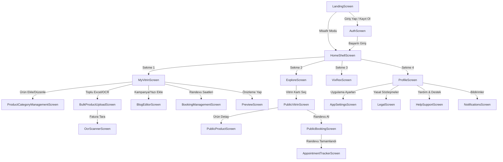

# Vixrex Sayfa ve Akış Planı (Technical Page Map & Flow Plan)

Vixrex platformu, **İşletme Yönetim Akışı** (Flutter Mobil/Web) ve **Müşteri Vitrin Akışı** (Next.js Web) olmak üzere iki temel kulvardan oluşur. Aşağıdaki belgede, uygulamadaki tüm sayfaların rotaları, durum yönetimleri, güvenlik seviyeleri, özel bileşenleri ve yedek durumları detaylandırılmıştır.

---

## 1. Sayfa Akış Şeması (Navigation Flowchart)

---

## 2. Flutter Mobil ve Yönetim Uygulaması Detayları (22 Ekran)

### 2.1 Giriş ve Karşılama Ekranları

#### 1. LandingScreen ([landing_screen.dart](file:///C:/Projects/vixrex/lib/screens/landing_screen.dart))
*   **İşlevi:** Uygulamayı tanıtan, hazır şablonları sunan ve kullanıcıyı giriş yapmaya veya doğrudan misafir olarak düzenlemeye teşvik eden ana giriş sayfası.
*   **Teknik Özellikler:**
    *   **Rota (Route Path):** `/`
    *   **Durum Yönetimi (State Management):** `_LandingScreenState` (Yerel durum)
    *   **Güvenlik (Security Level):** Herkese Açık (Anonymous)
    *   **Özel Bileşenler (Custom Widgets):** `LandingHeroSection`, `LandingValueBand`, `LandingFeaturesSection`, `LandingTemplateCatalog`, `ChatbotBadge`
    *   **Yedek Durumlar (Fallback States):** Kayıtlı yerel vitrin kontrolü sırasında yükleme göstergesi (`_isCheckingSavedVitrin`).

#### 2. AuthScreen ([auth_screen.dart](file:///C:/Projects/vixrex/lib/screens/auth_screen.dart))
*   **İşlevi:** Giriş yapma, yeni kayıt oluşturma ve şifre sıfırlama işlemlerini barındırır.
*   **Teknik Özellikler:**
    *   **Rota (Route Path):** `/auth`
    *   **Durum Yönetimi (State Management):** `_AuthScreenState` (Giriş/Kayıt mod geçişleri)
    *   **Güvenlik (Security Level):** Herkese Açık (Anonymous)
    *   **Özel Bileşenler (Custom Widgets):** Özelleştirilmiş Giriş Kartı (Card), E-posta/Şifre Formu
    *   **Yedek Durumlar (Fallback States):** Hata durumlarında kırmızı renkli yüzen bildirim (`_showError` SnackBar), işlem sırasında yükleme çemberi (`CircularProgressIndicator`).

---

### 2.2 Ana Kabuk ve Sekme Ekranları

#### 3. HomeShellScreen ([home_shell_screen.dart](file:///C:/Projects/vixrex/lib/screens/home_shell_screen.dart))
*   **İşlevi:** Uygulamanın ana sayfa düzenidir, alttaki 4 ana sekme arasında gezinmeyi sağlar.
*   **Teknik Özellikler:**
    *   **Rota (Route Path):** `/app` veya `/home`
    *   **Durum Yönetimi (State Management):** `_HomeShellScreenState` (Sekme dizini takibi)
    *   **Güvenlik (Security Level):** Herkese Açık / Misafir olarak erişilebilir
    *   **Özel Bileşenler (Custom Widgets):** `NavigationBar` (M3 standardında alt gezinti barı)

#### 4. MyVitrinScreen ([my_vitrin_screen.dart](file:///C:/Projects/vixrex/lib/screens/my_vitrin_screen.dart))
*   **İşlevi:** İşletme sahibinin dijital vitrin bilgilerini doldurduğu ve güncellediği ana yönetim alanıdır.
*   **Teknik Özellikler:**
    *   **Rota (Route Path):** `/app` (HomeShell Sekme 1)
    *   **Durum Yönetimi (State Management):** `StoreEditorController` ve `MyVitrinState`
    *   **Güvenlik (Security Level):** Oturum Açmış (Authenticated) veya yerel `edit_token` sahibi misafir
    *   **Özel Bileşenler (Custom Widgets):** `VitrinFormSection`, `VitrinPublishSection`, `VitrinDangerSection`, [PublicLinkCard](file:///C:/Projects/vixrex/lib/widgets/editor/public_link_card.dart), `InstagramSyncSection`, `ProductManagementEntryCard`
    *   **Yedek Durumlar (Fallback States):** Bilgiler yerelden veya veritabanından çekilirken tam ekran yükleme animasyonu (`_controller.isLoading`).

#### 5. ExploreScreen ([explore_screen.dart](file:///C:/Projects/vixrex/lib/screens/explore_screen.dart))
*   **İşlevi:** Yayındaki diğer tüm esnaf vitrinlerinin aranıp listelendiği alandır.
*   **Teknik Özellikler:**
    *   **Rota (Route Path):** `/home` (HomeShell Sekme 2)
    *   **Durum Yönetimi (State Management):** `ExploreController`
    *   **Güvenlik (Security Level):** Herkese Açık (Anonymous)
    *   **Özel Bileşenler (Custom Widgets):** `ExploreSearchBar`, `VitrinStoreCard`
    *   **Yedek Durumlar (Fallback States):** Boş arama sonuçlarında "Arama sonucu bulunamadı" resmi ve yeniden deneme (Retry) aksiyonu.

#### 6. VixRexScreen ([vixrex_screen.dart](file:///C:/Projects/vixrex/lib/screens/vixrex_screen.dart))
*   **İşlevi:** Vixrex asistan/rehber maskotunun yer aldığı, kullanıcıya vitrinini iyileştirmesi için öneriler sunan yapay zeka rehber sekmesidir.
*   **Teknik Özellikler:**
    *   **Rota (Route Path):** HomeShell Sekme 3
    *   **Durum Yönetimi (State Management):** `VixRexProfileSnapshot` ile veri eşleme
    *   **Güvenlik (Security Level):** Herkese Açık / Misafir
    *   **Özel Bileşenler (Custom Widgets):** `VixRexHero` (Mascot animasyon yüzeyi), `VixRexProgressCard`, `VixRexRecommendationCard`
    *   **Yedek Durumlar (Fallback States):** Vitrin kalitesi 100/100 ise "Tüm adımlar tamamlandı" kutusu gösterilir.

#### 7. ProfileScreen ([profile_screen.dart](file:///C:/Projects/vixrex/lib/screens/profile_screen.dart))
*   **İşlevi:** Kullanıcı profili, dil, tema ve hesap yönetiminin yapıldığı sekmedir.
*   **Teknik Özellikler:**
    *   **Rota (Route Path):** HomeShell Sekme 4
    *   **Durum Yönetimi (State Management):** `_ProfileScreenState`
    *   **Güvenlik (Security Level):** Kayıtlı esnaf (Authenticated) veya Misafir
    *   **Yedek Durumlar (Fallback States):** Misafir kullanıcıda "E-posta bağla" butonu ve oturum açma uyarısı gösterilir.

---

### 2.3 Yönetim ve Düzenleme Ekranları

#### 8. ProductCategoryManagementScreen ([product_category_management_screen.dart](file:///C:/Projects/vixrex/lib/screens/product_category_management_screen.dart))
*   **İşlevi:** Vitrindeki ürünlerin ayrıştırıldığı kategorileri ve sıralamasını düzenler.
*   **Teknik Özellikler:**
    *   **Rota (Route Path):** MyVitrin alt ekranı (Bottom Sheet)
    *   **Durum Yönetimi (State Management):** `StoreEditorController`
    *   **Güvenlik (Security Level):** Vitrin Sahibi
    *   **Özel Bileşenler (Custom Widgets):** `ReorderableListView` (Sürükle-bırak liste elemanı)
    *   **Yedek Durumlar (Fallback States):** Kategoriler boşsa "Henüz kategori eklenmedi" uyarısı.

#### 9. BulkProductUploadScreen ([bulk_product_upload_screen.dart](file:///C:/Projects/vixrex/lib/screens/bulk_product_upload_screen.dart))
*   **İşlevi:** Excel dosyası yükleyerek veya fatura tarayarak vitrine tek seferde toplu ürün aktarmayı sağlar.
*   **Teknik Özellikler:**
    *   **Rota (Route Path):** MyVitrin alt ekranı
    *   **Durum Yönetimi (State Management):** `BulkProductUploadController`
    *   **Güvenlik (Security Level):** Vitrin Sahibi
    *   **Özel Bileşenler (Custom Widgets):** `OcrResultList` (Okuma sonuç kartları)
    *   **Yedek Durumlar (Fallback States):** Okuma hatalarında veya boş şablonlarda hata uyarı panelleri.

#### 10. OcrScannerScreen ([ocr_scanner_screen.dart](file:///C:/Projects/vixrex/lib/screens/ocr_scanner_screen.dart))
*   **İşlevi:** Telefon kamerasıyla çekilen veya galeriden yüklenen fatura görselindeki ürünleri okur.
*   **Teknik Özellikler:**
    *   **Rota (Route Path):** BulkProductUpload alt akışı
    *   **Durum Yönetimi (State Management):** `OcrController`
    *   **Güvenlik (Security Level):** Vitrin Sahibi (Premium Limit kontrolü ile)
    *   **Özel Bileşenler (Custom Widgets):** `OcrScannerWidget`
    *   **Yedek Durumlar (Fallback States):** Görüntü işleme (gri tonlama/kontrast) sırasında `CircularProgressIndicator` ve OCR okuma başarısız olursa "Yazı bulunamadı" uyarısı.

#### 11. BlogEditorScreen ([blog_editor_screen.dart](file:///C:/Projects/vixrex/lib/screens/blog_editor_screen.dart))
*   **İşlevi:** İşletmeye ait duyuru, kampanya veya makaleleri yazma arayüzüdür.
*   **Teknik Özellikler:**
    *   **Rota (Route Path):** `/v/:slug/yazilar/editor`
    *   **Durum Yönetimi (State Management):** `BlogEditorController`
    *   **Güvenlik (Security Level):** Vitrin Sahibi (Supabase RLS: Yalnızca yazıyı oluşturan güncelleyebilir)
    *   **Yedek Durumlar (Fallback States):** İnternet yoksa taslak kaydetme hata uyarıları.

#### 12. BlogModerationScreen ([blog_moderation_screen.dart](file:///C:/Projects/vixrex/lib/screens/blog_moderation_screen.dart))
*   **İşlevi:** Şikayet edilen veya onay bekleyen esnaf blog yazılarını inceleyen admin kontrol ekranıdır.
*   **Teknik Özellikler:**
    *   **Rota (Route Path):** `/admin/moderation`
    *   **Durum Yönetimi (State Management):** `_BlogModerationScreenState`
    *   **Güvenlik (Security Level):** Yalnızca Sistem Yöneticileri (Admin yetkilendirmesi)
    *   **Yedek Durumlar (Fallback States):** Bekleyen yazı yoksa "İncelenecek içerik bulunmuyor" boş ekranı.

#### 13. BookingManagementScreen ([booking_management_screen.dart](file:///C:/Projects/vixrex/lib/screens/booking_management_screen.dart))
*   **İşlevi:** Esnafın müşterilerden gelen randevu taleplerini yönettiği randevu kontrol merkezidir.
*   **Teknik Özellikler:**
    *   **Rota (Route Path):** `/bookings/:slug`
    *   **Durum Yönetimi (State Management):** `BookingManagementController`
    *   **Güvenlik (Security Level):** Vitrin Sahibi
    *   **Yedek Durumlar (Fallback States):** Randevu bulunmayan günlerde boş randevu çizelgesi görünümü.

---

### 2.4 Müşteri ve Kamu Yüzü Ekranları (Uygulama İçi)

#### 14. PreviewScreen ([preview_screen.dart](file:///C:/Projects/vixrex/lib/screens/preview_screen.dart))
*   **İşlevi:** İşletme sahibine, vitrininin yayına alındığında müşteriler tarafından web'de nasıl görüneceğini gösteren mobil ve masaüstü önizleme simülatörüdür.
*   **Teknik Özellikler:**
    *   **Rota (Route Path):** Yerel Geçiş
    *   **Durum Yönetimi (State Management):** `_PreviewScreenState`
    *   **Güvenlik (Security Level):** Yalnızca Vitrin Sahibi
    *   **Özel Bileşenler (Custom Widgets):** `PhoneMockup` (Sanal telefon çerçevesi), `VitrinCoverSurface`, `VitrinHeaderIdentity`

#### 15. PublicVitrinScreen ([public_vitrin_screen.dart](file:///C:/Projects/vixrex/lib/screens/public_vitrin_screen.dart))
*   **İşlevi:** Müşterinin veya ziyaretçinin açtığı, işletmeye ait dijital vitrin ana sayfasıdır.
*   **Teknik Özellikler:**
    *   **Rota (Route Path):** `/v/:slug`
    *   **Durum Yönetimi (State Management):** `_PublicVitrinScreenState`
    *   **Güvenlik (Security Level):** Herkese Açık (Anonymous)
    *   **Özel Bileşenler (Custom Widgets):** `VitrinPublicHero`, `VitrinShelfGallery`, `VitrinProductsCatalog`, `VitrinLinksHub`, `VitrinActionButtons`
    *   **Yedek Durumlar (Fallback States):** Vitrin bulunamazsa 404/Bulunamadı ekranı, yüklenirken yükleme göstergesi.

#### 16. PublicProductScreen ([public_product_screen.dart](file:///C:/Projects/vixrex/lib/screens/public_product_screen.dart))
*   **İşlevi:** Vitrindeki bir ürüne tıklandığında açılan ürün detay kartıdır.
*   **Teknik Özellikler:**
    *   **Rota (Route Path):** `/v/:slug/urun/:productSlug`
    *   **Durum Yönetimi (State Management):** Yerel State
    *   **Güvenlik (Security Level):** Herkese Açık (Anonymous)
    *   **Yedek Durumlar (Fallback States):** Ürün görseli yoksa varsayılan boş ürün görseli fallback'i.

#### 17. PublicBookingScreen ([public_booking_screen.dart](file:///C:/Projects/vixrex/lib/screens/public_booking_screen.dart))
*   **İşlevi:** Müşterinin vitrin üzerinden randevu alma sihirbazıdır.
*   **Teknik Özellikler:**
    *   **Rota (Route Path):** `/v/:slug/randevu`
    *   **Durum Yönetimi (State Management):** `BookingWizardController`
    *   **Güvenlik (Security Level):** Herkese Açık (Anonymous)
    *   **Yedek Durumlar (Fallback States):** Seçilen gün tatil veya kapalı ise saat seçimi listesinde "Uygun saat bulunmamaktadır" uyarısı.

#### 18. AppointmentTrackerScreen ([appointment_tracker_screen.dart](file:///C:/Projects/vixrex/lib/screens/appointment_tracker_screen.dart))
*   **İşlevi:** Randevu talebini tamamlayan müşterinin randevu durumunu izlediği takip sayfasıdır.
*   **Teknik Özellikler:**
    *   **Rota (Route Path):** `/v/:slug/randevu/:token`
    *   **Durum Yönetimi (State Management):** `AppointmentTrackerController`
    *   **Güvenlik (Security Level):** Herkese Açık (Doğru randevu token'ına sahip olan herkes görebilir)
    *   **Yedek Durumlar (Fallback States):** Geçersiz token girilirse "Randevu kaydı bulunamadı" hata ekranı.

---

### 2.5 Destek, Ayarlar ve Yasal Ekranlar

#### 19. AppSettingsScreen ([app_settings_screen.dart](file:///C:/Projects/vixrex/lib/screens/app_settings_screen.dart))
*   **İşlevi:** Uygulama genel ayarlarını yönetir.
*   **Teknik Özellikler:**
    *   **Rota (Route Path):** `/settings`
    *   **Durum Yönetimi (State Management):** Yerel State
    *   **Güvenlik (Security Level):** Herkese Açık / Misafir

#### 20. HelpSupportScreen ([help_support_screen.dart](file:///C:/Projects/vixrex/lib/screens/help_support_screen.dart))
*   **İşlevi:** Soru, sorun ve teknik destek taleplerinin iletildiği ekrandır.
*   **Teknik Özellikler:**
    *   **Rota (Route Path):** `/help`
    *   **Durum Yönetimi (State Management):** Yerel State
    *   **Güvenlik (Security Level):** Herkese Açık

#### 21. NotificationsScreen ([notifications_screen.dart](file:///C:/Projects/vixrex/lib/screens/notifications_screen.dart))
*   **İşlevi:** Kullanıcıya (esnafa) gelen randevu onayları, iptaller ve sistem bildirimlerinin listesidir.
*   **Teknik Özellikler:**
    *   **Rota (Route Path):** `/notifications`
    *   **Durum Yönetimi (State Management):** Yerel State
    *   **Güvenlik (Security Level):** Kayıtlı Kullanıcı
    *   **Yedek Durumlar (Fallback States):** Bildirim yoksa "Yeni bildiriminiz bulunmuyor" boş ekranı.

#### 22. LegalScreen ([legal_screen.dart](file:///C:/Projects/vixrex/lib/screens/legal_screen.dart))
*   **İşlevi:** Gizlilik, kullanım şartları ve yasal onay metinlerini gösteren yasal okuyucudur.
*   **Teknik Özellikler:**
    *   **Rota (Route Path):** `/legal/:type` (Örn: `/privacy`, `/terms`, `/consent`, `/data-deletion`)
    *   **Durum Yönetimi (State Management):** Yerel State
    *   **Güvenlik (Security Level):** Herkese Açık (Anonymous)
    *   **Yedek Durumlar (Fallback States):** Supabase'ten veri çekilemezse yerel yedek (hardcoded fallback) metinler gösterilir.

---

## 3. Next.js Herkese Açık Web Sayfaları (9 Sayfa)

Müşterilerin tarayıcıdan (`/v/[slug]`) eriştiği Next.js tabanlı `public_web/src/app` dizinindeki sayfalar.

#### 1. Vitrin Sayfası (`/v/[slug]` - [page.tsx](file:///C:/Projects/vixrex/public_web/src/app/v/[slug]/page.tsx))
*   **Teknik Özellikler:**
    *   **Yönlendirme (Routing):** `/v/[slug]` (Dinamik Web Rotası)
    *   **Durum Yönetimi (State Management):** SSR (Server-Side Rendering) ile sunucu tarafı veri yönetimi.
    *   **Güvenlik (Security):** Herkese Açık (Anonymous)
    *   **Özel Bileşenler:** `ProductCatalog`, `GallerySlider`, `ContactButtons`

#### 2. Randevu Sihirbazı (`/v/[slug]/randevu` - [page.tsx](file:///C:/Projects/vixrex/public_web/src/app/v/[slug]/randevu/page.tsx))
*   **Teknik Özellikler:**
    *   **Yönlendirme (Routing):** `/v/[slug]/randevu`
    *   **Durum Yönetimi (State Management):** React Local State ve `BookingWizardClient`
    *   **Güvenlik (Security):** Herkese Açık (Ziyaretçi bot koruması / Turnstile opsiyonlu)
    *   **Yedek Durumlar:** Hatalı form girişlerinde istemci tarafı validasyon uyarıları.

#### 3. Randevu Takip Sayfası (`/v/[slug]/randevu/[token]` - [page.tsx](file:///C:/Projects/vixrex/public_web/src/app/v/[slug]/randevu/[token]/page.tsx))
*   **Teknik Özellikler:**
    *   **Yönlendirme (Routing):** `/v/[slug]/randevu/[token]`
    *   **Durum Yönetimi (State Management):** Dinamik Sunucu Sorgusu
    *   **Güvenlik (Security):** Belirteç (Token) doğrulaması ile şifrelenmiş erişim.

#### 4. Ürün Detay Sayfası (`/v/[slug]/urun/[productSlug]` - [page.tsx](file:///C:/Projects/vixrex/public_web/src/app/v/[slug]/urun/[productSlug]/page.tsx))
*   **Teknik Özellikler:**
    *   **Yönlendirme (Routing):** `/v/[slug]/urun/[productSlug]`
    *   **Durum Yönetimi (State Management):** SSR ve SEO JSON-LD Entegrasyonu
    *   **Güvenlik (Security):** Herkese Açık (Anonymous)
    *   **Yedek Durumlar:** Olmayan üründe 404 / Bulunamadı Web şablonu.

#### 5. Blog/Makale Listesi (`/v/[slug]/yazilar` - [page.tsx](file:///C:/Projects/vixrex/public_web/src/app/v/[slug]/yazilar/page.tsx))
*   **Teknik Özellikler:**
    *   **Yönlendirme (Routing):** `/v/[slug]/yazilar`
    *   **Durum Yönetimi (State Management):** SSR (Server-Side Rendering)
    *   **Güvenlik (Security):** Herkese Açık

#### 6. Blog Detay Sayfası (`/v/[slug]/yazilar/[articleSlug]` - [page.tsx](file:///C:/Projects/vixrex/public_web/src/app/v/[slug]/yazilar/[articleSlug]/page.tsx))
*   **Teknik Özellikler:**
    *   **Yönlendirme (Routing):** `/v/[slug]/yazilar/[articleSlug]`
    *   **Durum Yönetimi (State Management):** SSR ve SEO JSON-LD
    *   **Güvenlik (Security):** Herkese Açık (Sadece admin onaylı `published` makaleler görüntülenebilir)

#### 7. Genel Gizlilik Sözleşmesi (`/privacy` - [page.tsx](file:///C:/Projects/vixrex/public_web/src/app/privacy/page.tsx))
*   **Teknik Özellikler:**
    *   **Yönlendirme (Routing):** `/privacy`
    *   **Güvenlik (Security):** Herkese Açık

#### 8. Veri Silme Talebi Sorgusu (`/data-deletion/status/[code]` - [page.tsx](file:///C:/Projects/vixrex/public_web/src/app/data-deletion/status/[code]/page.tsx))
*   **Teknik Özellikler:**
    *   **Yönlendirme (Routing):** `/data-deletion/status/[code]`
    *   **Durum Yönetimi (State Management):** Dinamik API sorguları
    *   **Güvenlik (Security):** Meta API standartlarına göre şifrelenmiş kod sorgulaması.

#### 9. Instagram Callback (`/instagram/baglanti-tamamlandi` - [page.tsx](file:///C:/Projects/vixrex/public_web/src/app/instagram/baglanti-tamamlandi/page.tsx))
*   **Teknik Özellikler:**
    *   **Yönlendirme (Routing):** `/instagram/baglanti-tamamlandi`
    *   **Durum Yönetimi (State Management):** OAuth Redirect URI kontrolü
    *   **Güvenlik (Security):** SSL/TLS ve hash doğrulamalı Instagram State kontrolü.
